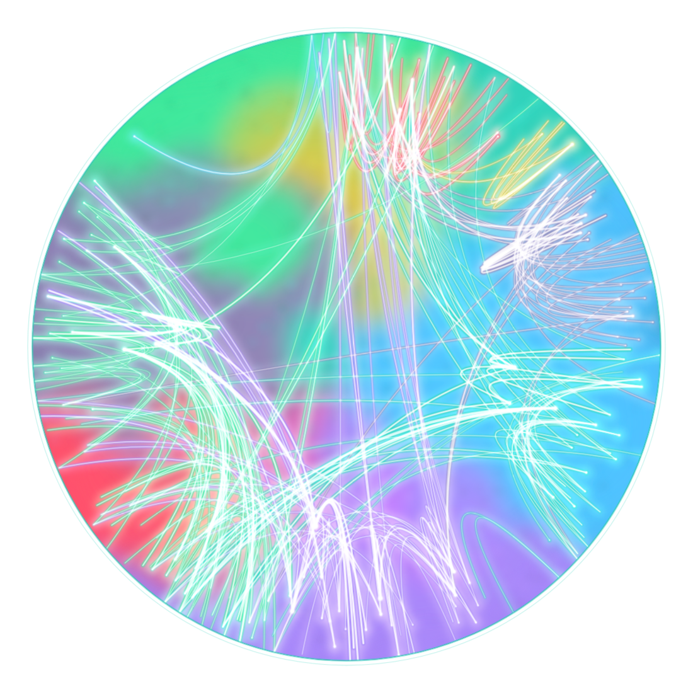

# candor

<p align="center"></p>

**Architecture-as-code enforcement for the JVM — for CI, humans, and AI agents.** candor reads JVM
bytecode (Java, Kotlin, Scala, Groovy) and knows which functions reach the network, filesystem, a
database, a subprocess — *transitively, across packages* — then turns invariants like *"the domain
layer does no I/O"* into a policy that fails the build when an edit breaks them. The same spec runs as
full engines in Rust, TypeScript and Swift, kept in agreement by a machine-checked conformance suite — so
one mental model and one policy file work across your whole stack. **candor-java is the reference
implementation; the others are first-class, conformance-checked engines.**

**Site:** [candor.poly.io](https://candor.poly.io) — the measured case in five minutes: the
exhibits, the pre-registered evals, and the prove-it-on-your-own-repo path.

| repo | what |
|---|---|
| [candor-java](https://github.com/tombaldwin/candor-java) | **the reference implementation — the JVM engine** (Java, Kotlin, Scala, Groovy — reads bytecode): scanning, the policy gate, queries — `jbang candor@tombaldwin/candor-java` |
| [candor-spec](https://github.com/tombaldwin/candor-spec) | the specification (report format, semantics, policy DSL, conformance suite) — implementable from its text alone |
| [candor-rust](https://github.com/tombaldwin/candor-rust) | the Rust engine (`cargo install candor-scan`); a conformance engine — and where the eval harness lives |
| [candor-ts](https://github.com/tombaldwin/candor-ts) | the TypeScript engine (**on npm**: `npx -y candor-ts`); a conformance engine |
| [candor-swift](https://github.com/tombaldwin/candor-swift) | the Swift engine (SwiftSyntax); a conformance engine |
| [candor-agents](https://github.com/tombaldwin/candor-agents) | effect analysis for agent fleets (declared-vs-observed drift), gated by the unmodified candor tools — exploratory |

**AI agent?** Start at [AGENTS.md](AGENTS.md) — it routes you to the right per-language instructions.

**Sceptical?** Good. Each implementation ships a PROVE-IT self-experiment your own agent runs on
your own repo ([Rust](https://github.com/tombaldwin/candor-rust/blob/main/PROVE-IT.md) ·
[JVM](https://github.com/tombaldwin/candor-java/blob/main/PROVE-IT.md) ·
[TypeScript](https://github.com/tombaldwin/candor-ts/blob/main/PROVE-IT.md)) — manual blast-radius trace committed *before*
the tool runs, every claimed miss verified at a file:line, and the negative outcome reported plainly
if candor doesn't help on your codebase. The implementations also hold their own gates: each analyzes
itself in CI under a declared policy (spec §7.12).

## The 30-second pitch

Code silently crosses architectural boundaries — a network call inside a domain layer, a DB query in a
UI handler. Reviews (human or LLM) catch this probabilistically; candor catches it
**deterministically**: a curated classifier at the I/O boundary, transitive propagation to a fixpoint,
an explicit `Unknown` wherever resolution fails (it discloses what it can't resolve rather than
guessing — held to it by adversarial fuzzers in CI), and a policy gate over the result. Purity is
undecidable, so this is a best-effort gate that catches far more than review and tells you where it
couldn't see — not a completeness proof; the gaps it's still closing are tracked in the open. For
agents it also answers the pre-edit question — *"if I add an effect here, what's the blast radius and
does it break policy?"* — in one query (measured on the Rust engine:
[~1.8× faster](https://github.com/tombaldwin/candor-rust/blob/main/eval/scaled/RESULTS-speed.md) than
tracing by hand at equal completeness).

## One `candor` across every language

Every engine drives a query the same way (candor-spec §3.3.1): the report is discovered from a `.candor/`
ancestor, so `candor where Net`, `candor path <fn> Net`, and `candor scan .` are one command regardless of
language. [`bin/candor`](bin/candor) is a thin dispatcher that routes a **query** to the engine whose backend
the discovered report declares, and a **scan** to the engine whose manifest the target holds
(`Cargo.toml`/`package.json`/Gradle/`Package.swift`). It owns the bare `candor` name so the four language
engines — which keep their qualified names `candor-query`, `candor-ts-query`, `candor-java`, `candor-swift` —
don't collide on `PATH`. A polyglot project or a missing engine is a loud error, never a silent wrong-engine
run. Put `bin/` on your `PATH`; the routing is covered by [`bin/candor.test.sh`](bin/candor.test.sh).

## Get the gate on your repo

One command, no annotations or source changes ([`adopt/candor-init.sh`](adopt/candor-init.sh)). To get
it, clone this repo (or copy `adopt/` plus `integrations/github/candor-sarif` — the script needs its
sibling files and exits 2 without them). Prerequisites: a JRE 17+, `python3`, and `curl` (Node.js
instead for the TypeScript engine, and for the fingerprint tool):

```bash
git clone https://github.com/tombaldwin/candor        # (once, anywhere)
cd your-repo
mvn -q compile                     # (or ./gradlew classes) — candor reads bytecode
/path/to/candor/adopt/candor-init.sh
```

It scans your compiled classes with the exact engine release the dropped workflow pins, **proposes** a
starter policy from what your code already does (every proposed rule currently passes — review it, keep
what matches your intent), records the regression-ratchet baseline, and drops the GitHub Action that
fails the build (pointing at the exact method) when an architecture rule is broken. It writes **five
artifacts** — `arch.policy`, `.candor/baseline.json`, `.candor/config`, `.candor/candor-sarif` (the
vendored SARIF reporter), and `.github/workflows/candor.yml` — **commit all of them**: the regression
ratchet bites only when the baseline is committed. Prefer to assemble it by hand?
[**`adopt/`**](adopt/) also has the pieces as a copy-paste starter — the annotated
[policy template](adopt/arch.policy) and the [workflow](adopt/candor.yml). See it running end-to-end on
real Spring, Kotlin, and Quarkus apps in the [case studies](docs/case-studies.md).

For coding agents, [`integrations/claude-code/`](integrations/claude-code/) closes the loop at edit time: a
Claude Code **Stop hook** scans the agent's result, diffs the effects against a baseline, and hands back any
newly-introduced effect (with its transitive blast radius) or policy violation so the agent fixes it *before
yielding to you* — the deterministic counterpart to "the model will probably notice."

The reports are also served live, one `npx` away, by two servers in the candor-ts npm package —
**`candor-mcp`** (an MCP server: blast radius, whatif, the gate verdict, containment, blindspots — for
any MCP-speaking agent) and **`candor-lsp`** (a language server: per-function effect CodeLens, provenance
hover, the live gate verdict as diagnostics — helix/neovim natively, JetBrains via
[`integrations/jetbrains/`](integrations/jetbrains/)). Both read **any** engine's report (JVM, Rust,
TypeScript, Swift), so one server covers the whole stack:
`npx -y -p candor-ts candor-mcp` · `npx -y -p candor-ts candor-lsp`.

## Effects fingerprint

<p align="center"></p>

[`fingerprint/`](fingerprint/) turns any engine's report into a fixed-size, text-free, **deterministic**
abstract mark of a project's effect profile — the effect mix as a colour nebula, effect-propagation
edges as weighted neon threads, and code structure as order-vs-chaos. Same report → same image. It also
emits the DNA as JSON — a single 0–100 **structure** descriptor (order vs chaos) plus its components
(effect smear, `Unknown` opacity, call-graph tangle, cycles). These are *structural descriptors, not a
quality grade*: candor deliberately doesn't score a codebase (spec §6.1). Works identically across all
engines. See [`fingerprint/README.md`](fingerprint/README.md).

## For maintainers

[`TESTING.md`](TESTING.md) — the family-wide test standards every candor repo holds: the two-layer
doctrine (unit for pure logic, process for contracts), the non-negotiable pins (every documented gate
surface tested in-repo, every fail-closed path negative-tested, anti-fabrication twins, emission-path
tests), byte-identity-gated refactors, and the coverage policy (no percentage gate; the
zero-coverage-gate list stays empty).

## License

Licensed under either of [MIT](LICENSE-MIT) or [Apache-2.0](LICENSE-APACHE), at your option.
